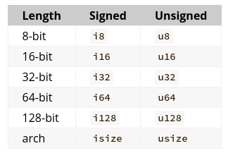

### Data types

+ 👍 Document in [here](https://doc.rust-lang.org/book/ch03-02-data-types.html)
+ Every value in Rust is of a certain data type
+ 👉 Keep in mind that Rust is a **statically typed** language, which means that it must know the types of all variables at compile time

### 🦀 Scalar Types

🥮 A scalar type represents a single value:

+ Integers
+ Floating-point numbers
+ Booleans
+ Characters

#### 💈 Integer Types



⚠ The `isize` and `usize` types depend on the kind of computer your program is running on: 64 bits if you’re on a 64-bit architecture and 32 bits if
you’re on a 32-bit architecture.

#### 🏛 Floating-Point Types

👉 Floating-point numbers are represented according to the IEEE-754 standard.

+ The `f32` type is a single-precision float.
+ The `f64` has double precision.

```rust
fn main() {
    let x = 2.0; // f64

    let y: f32 = 3.0; // f32
}
```

⚠ Rust’s floating-point types are `f32` and `f64`, which are `32 bits` and `64 bits` in size, respectively.

💥 The default type is `f64` because on modern CPUs it’s roughly the same speed as `f32` but is capable of more precision.

#### ♥ Numeric Operations

```rust
fn main() {
    // addition
    let sum = 5 + 10;

    // subtraction
    let difference = 95.5 - 4.3;

    // multiplication
    let product = 4 * 30;

    // division
    let quotient = 56.7 / 32.2;

    // remainder
    let remainder = 43 % 5;
}
```

#### 🐒 Boolean Type

👉 Booleans are 1 byte in size

```rust
fn main() {
    let success = true;

    let failed: bool = false; // with explicit type annotation
}
```

#### Character Type

⚠ Rust’s char type is four bytes in size and represents a Unicode Scalar Value

```rust
fn main() {
    let c = 'z';
    let z = 'ℤ';
    let heart_eyed_cat = '😻';
}
```

### Compound Types

👉 Compound types can group multiple values into one type.

#### Tuple Type

👉 A tuple is a general way of grouping together a number of values with a variety of types into one compound type

⚠ Tuples have a fixed length: once declared, they cannot grow or shrink in size.

```rust
fn main() {
    let tup: (i32, f64, u8) = (500, 6.4, 1);
}
```

👉 To get the individual values out of a tuple, we can use pattern matching to destructure

```rust
fn main() {
    let tup = (500, 6.4, 1);

    let (x, y, z) = tup;

    println!("The value of y is: {}", y);
}
```

👉 We can access a tuple element directly by using a period (.) followed by the index of the value we want to access

```rust
fn main() {
    let tup = (500, 10, 10.0);

    let first_value = tup.0;

    let second_value = tup.1;

    let three_value = tup.2;
}
```

#### The Array Type

👉 Unlike a tuple, every element of an array must have the same type

👉 Arrays in Rust are different from arrays in some other languages because arrays in Rust have a fixed length, like tuples.

```rust
fn main() {
    let arr: [i32; 5] = [1, 2, 3, 4, 5];
    //       ^^^^^^^^
    // [type of each element; number of elements]
}
```

👉 An array is a single chunk of memory allocated on the stack. You can access elements of an array using indexing

```rust
fn main() {
    let a = [1, 2, 3, 4, 5];

    let first = a[0];
    let second = a[1];
}
```

⚠ Arrays are useful when you want your data allocated on the stack rather than the heap.
